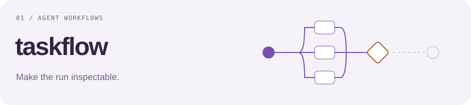
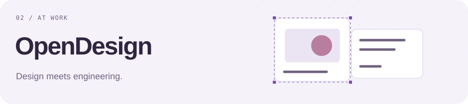
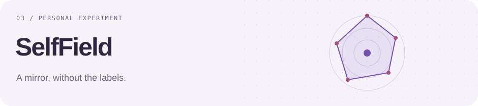

<!-- Visuals: original SVGs in assets/. Rebuild with python3 scripts/build_visuals.py. -->
<picture>
  <source media="(prefers-color-scheme: dark) and (max-width: 640px)" srcset="assets/hero-mobile-dark.svg">
  <source media="(max-width: 640px)" srcset="assets/hero-mobile-light.svg">
  <source media="(prefers-color-scheme: dark)" srcset="assets/hero-dark.svg">
  
</picture>

<p align="center">
  I build verifiable agent workflows and tools with a point of view.<br>
  Agent infrastructure &amp; product engineering at <a href="https://github.com/nexu-io/open-design">OpenDesign</a> · Shanghai
</p>

<p align="center">
  <a href="#selected-work"><b>Work ↗</b></a> &nbsp;&nbsp; / &nbsp;&nbsp;
  <a href="https://heggria.github.io/writing/"><b>Writing ↗</b></a> &nbsp;&nbsp; / &nbsp;&nbsp;
  <a href="#lets-build-something"><b>Collaborate ↗</b></a>
</p>

## Selected work

  <picture>
    <source media="(prefers-color-scheme: dark)" srcset="assets/taskflow-dark.svg">
    
  </picture>

**taskflow · Creator & maintainer**<br>
Declarative workflows for coding agents. Verify the graph, inspect what happened, replay the trace, and recompute what changed.

[Explore the code ↗](https://github.com/heggria/taskflow) · [Read the docs](https://heggria.github.io/taskflow/) · [Try an example](https://github.com/heggria/taskflow/tree/main/examples)

<sub>Published beta · MIT · [CI](https://github.com/heggria/taskflow/actions/workflows/ci.yml) · [Host support & limits](https://github.com/heggria/taskflow/blob/main/conformance/workspace/host-support-baseline.json)</sub>

<br>

  <picture>
    <source media="(prefers-color-scheme: dark)" srcset="assets/opendesign-dark.svg">
    
  </picture>

**OpenDesign · Where I work**<br>
An open-source, local-first design application. My work sits between agent infrastructure and full-stack product engineering.

[Explore OpenDesign ↗](https://github.com/nexu-io/open-design)

<br>

  <picture>
    <source media="(prefers-color-scheme: dark)" srcset="assets/selffield-dark.svg">
    
  </picture>

**SelfField · Personal experiment**<br>
A personal mirror built around evidence and tension, without personality labels.

[Open the experiment ↗](https://heggria.github.io/selffield/) · [Source](https://github.com/heggria/selffield)

## Fresh from the workbench

<sub>Recent public releases and writing. Dates show publication, not profile refreshes. Writing is in Chinese.</sub>

**Releases**
<!-- releases:start -->
- `2026-08-20` [taskflow v0.3.0-beta.1.2](https://github.com/heggria/taskflow/releases/tag/v0.3.0-beta.1.2) · prerelease
- `2026-08-18` [taskflow v0.3.0-beta.1.1](https://github.com/heggria/taskflow/releases/tag/v0.3.0-beta.1.1) · prerelease
<!-- releases:end -->

**Writing**
<!-- writing:start -->
- `2026-08-15` [八月的个人项目整理](https://heggria.github.io/writing/only-what-can-be-checked/)
- `2026-08-10` [让 Pi 审批记录显式确认](https://heggria.github.io/writing/approval-needs-a-yes/)
<!-- writing:end -->

[All releases](https://github.com/heggria/taskflow/releases) · [All writing](https://heggria.github.io/writing/) · [RSS](https://heggria.github.io/rss.xml)

## Let's build something

Interested in **agent orchestration, incremental computation, or making runs auditable**? Bring a reproducible workflow, a host integration fix, or a small example we can ship together.

[Start with an issue](https://github.com/heggria/taskflow/issues) · [Contribution guide](https://github.com/heggria/taskflow/blob/main/CONTRIBUTING.md) · [Email](mailto:bshengtao@gmail.com)

<details>
<summary><b>Under the hood — a real run &amp; honest boundaries</b></summary>

The header is an animated schematic. This is a recorded Pi run from my existing profile:

```text
⊗ taskflow self-improve  6/7 · blocked · $0.095
    ✓ discover            agent
  ┌ ✓ write-runner-tests  agent
  ├ ✓ write-store-tests   agent
  ├ ✓ write-agents-tests  agent
  └ ✓ fix-stability       agent
    ✓ verify              gate    BLOCK 3 type errors in test files
    ⊘ report              reduce  skipped · Gate blocked
```

The verification gate stopped downstream work. The trace explains why.

The published Trusted Effects beta describes declared filesystem effects and ledger-backed explanations. **Beta, not GA or an OS sandbox.** Adapter availability is separate from verified host enforcement: read the [support baseline](https://github.com/heggria/taskflow/blob/main/conformance/workspace/host-support-baseline.json) and [security boundaries](https://github.com/heggria/taskflow#security-boundaries-we-state-plainly).

</details>

<details>
<summary><b>Notes, side projects &amp; why I build this way</b></summary>

Getting something to run once is only the beginning. I want the next person — including future me — to understand what happened and make the next run cheaper.

**Evidence outlives confidence. Constraints give a tool its character.**

- [Work should outlive chat](https://heggria.github.io/writing/work-should-outlive-chat/)
- [Trust comes from boundaries](https://heggria.github.io/writing/trust-comes-from-boundaries/)
- [Small tools, sharp edges](https://heggria.github.io/writing/small-tools-sharp-edges/)
- [home-compass](https://github.com/heggria/home-compass) — housing scorecards built around real-life constraints.
- **Hermit** — my private, personal daily driver for governed long-running work.
- **cli-lab** — private CLI experiments; the public standalone predecessors are archived snapshots.

[Personal site](https://heggria.github.io/) · [Bilibili](https://space.bilibili.com/20296120)

</details>

---

<p align="center"><sub>Made to be understood. Built to be revisited.<br>Original SVG studies · light / dark · reduced-motion aware</sub></p>
